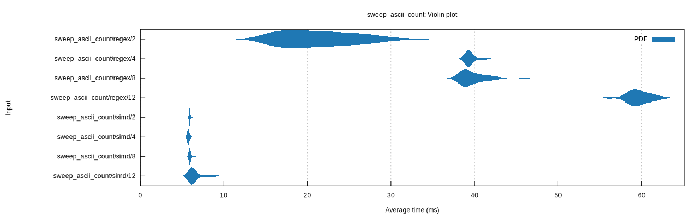
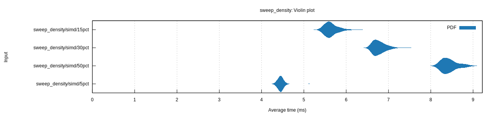
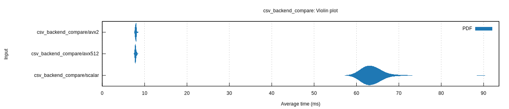
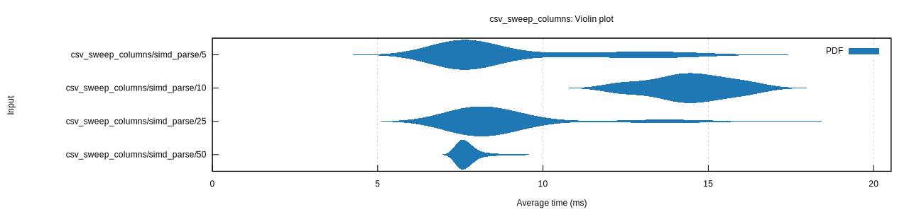
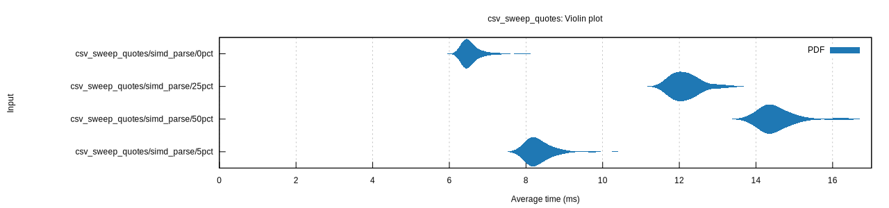
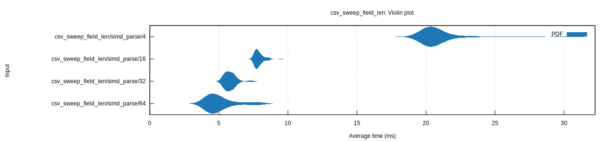

[](https://github.com/debe/libfindchars/actions/workflows/build.yml)
[](https://www.apache.org/licenses/LICENSE-2.0)
[](https://jdk.java.net/25/)
[](https://www.rust-lang.org/)

# libfindchars

High-performance character detection using SIMD instructions. Finds ASCII and multi-byte UTF-8 characters in byte sequences at **~2 GB/s** per core. A constraint solver (Z3) finds optimal shuffle mask configurations at build time; the runtime engine executes detection at full vector width.

Use cases: tokenizers, parsers, CSV/JSON/TOML pre-processing, or any workload involving fast character classification on large byte buffers.

The [specification](spec/00-index.md) (73 requirements) defines the observable contract. Two conforming implementations:

| | Java | Rust |
|---|---|---|
| **Location** | [`java/`](java/) | [`rust/`](rust/) |
| **Runtime** | JDK 25 Vector API | `std::arch` intrinsics |
| **Backends** | AVX-512, AVX2, NEON | AVX-512, AVX2, NEON |
| **Maturity** | Production | In progress |

---

## Table of Contents

- [How It Works](#how-it-works)
- [Quick Start](#quick-start) - [Java](#java) | [Rust](#rust-1)
- [Installation](#installation) - [Java](#java-1) | [Rust](#rust-2)
- [Benchmark: Character Detection](#benchmark-character-detection)
- [Benchmark: CSV Parser](#benchmark-csv-parser)
- [VPA Chunk Filter Framework](#vpa-chunk-filter-framework)
- [CSV Parser](#csv-parser)
- [Solver Limits](#solver-limits)
- [Building](#building)

---

## How It Works

* **Z3 nibble-matrix solver.** Each byte splits into low and high nibble (4 bits each), giving a 16x16 lookup grid. [Z3](https://github.com/Z3Prover/z3) finds two 16-entry shuffle vectors whose AND produces a unique literal byte for every target character and zero for everything else. A single group solves ~12 ASCII literals; auto-split doubles that to ~20-24.

* **UTF-8 multi-byte detection** via per-round shuffle mask solving across continuation bytes. 2-byte, 3-byte, and 4-byte codepoints are detected by gating lead byte classification with per-round literal matching.

* **Vector range operations** for contiguous byte ranges (e.g. `0-9`, `<=>`) without consuming nibble-matrix capacity -- each range costs 1 literal ID.

* **Bytecode-compiled engine** (Java) / **monomorphized generics** (Rust) for zero-overhead inlined SIMD.

* **VPA chunk filters** for parsing beyond regular languages. Vectorized Hillis-Steele parallel prefix operations (`prefixXor` for quote toggle, `prefixSum` for nesting depth) enable SIMD-accelerated CSV, JSON, and TOML parsing.

---

## Quick Start

### Java

```java
var result = Utf8EngineBuilder.builder()
        .codepoints("whitespace", '\r', '\n', '\t', ' ')
        .codepoints("punct", ':', ';', '{', '}')
        .range("digits", (byte) 0x30, (byte) 0x39)
        .build();
var engine = result.engine();
var literals = result.literals();

var storage = new MatchStorage(data.length / 4, 32);
var match = engine.find(mappedFile, storage);

for (int i = 0; i < match.size(); i++) {
    byte lit = match.getLiteralAt(storage, i);
    long pos = match.getPositionAt(storage, i);
}
```

### Rust

```rust
let result = findchars::EngineBuilder::new()
    .codepoints("whitespace", &[b'\r', b'\n', b'\t', b' '])
    .codepoints("punct", &[b':', b';', b'{', b'}'])
    .range("digits", b'0', b'9')
    .build()?;

let mut storage = MatchStorage::new(data.len() / 4);
let view = result.engine.find(data, &mut storage);

for i in 0..view.len() {
    let lit = view.literal(i);
    let pos = view.position(i);
}
```

---

## Installation

### Java

Requires **JDK 25**. Bytecode is compiled with `--enable-preview` and depends on `jdk.incubator.vector`.

**Maven:**
```xml
<dependency>
    <groupId>org.knownhosts</groupId>
    <artifactId>libfindchars-compiler</artifactId>
    <version>0.4.0-jdk25-preview</version>
</dependency>
```

**Gradle:**
```kotlin
implementation("org.knownhosts:libfindchars-compiler:0.4.0-jdk25-preview")
```

**Runtime JVM arguments:**
```
--enable-preview --add-modules=jdk.incubator.vector
```

### Rust

Requires **Rust 1.94+**. The solver crate depends on Z3 (built from source on first compile, ~5 min, cached thereafter).

```toml
# Cargo.toml
[dependencies]
findchars = "0.1"

# For CSV parsing
findchars-csv = "0.1"

# For build.rs codegen (build-dependency only, not shipped)
[build-dependencies]
findchars-solver = "0.1"
```

SIMD backend is auto-detected at engine construction time (AVX-512 > AVX2 > NEON > scalar).

---

## Benchmark: Character Detection

**Environment:** AVX-512, single core, 10 MB data. Both implementations use the same SIMD algorithm.

| | Java (JMH) | Rust (Criterion) |
|---|---|---|
| **ASCII scan (4-8 targets)** | ~2.0 GB/s | ~2.0 GB/s |
| **vs regex** | 7-16x faster | 3-9x faster |
| **Mixed UTF-8 (2/3/4-byte)** | ~1.5 GB/s | ~1.5 GB/s |

### Java

Parameter sweep: ASCII literal count, match density, multi-byte codepoint count, group count.


<details>
<summary>Cost model (hardware counters)</summary>

Hardware counters (`-prof perfnorm`) show cost is driven by match density and shuffle rounds. ASCII count and group count have minimal effect.


| Engine | a (base) | b (density) | c (rounds) | R^2 |
|--------|---:|---:|---:|---:|
| SIMD Compiled | 1.70 | 5.68 | 1.75 | 0.90 |
| Regex  | 7.42 | 127.84 | 38.46 | 0.87 |

The compiled engine's density cost is **22x smaller** than regex (5.7 vs 128 insn/byte).


</details>

### Rust

Parameter sweep: ASCII target count (2-12) and match density (5-50%).

**ASCII target count** (15% density, 10 MB):



**Match density** (8 targets, 10 MB):



| Targets | findchars | regex crate | Speedup |
|---------|-----------|-------------|---------|
| 2 | 1.65 GiB/s | 467 MiB/s | 3.6x |
| 4 | 1.68 GiB/s | 253 MiB/s | 6.8x |
| 8 | 1.64 GiB/s | 251 MiB/s | 6.7x |
| 12 | 1.47 GiB/s | 168 MiB/s | 9.0x |

Throughput stays flat regardless of target count (sublinear scaling). Regex degrades linearly.

```bash
# Java sweep
scripts/run-sweep.sh              # Full (~6 min)
scripts/run-sweep.sh --quick      # Smoke test (~1 min)
scripts/run-sweep.sh --perfnorm   # With hardware counters

# Rust sweep
scripts/run-sweep-rust.sh         # Full
scripts/run-sweep-rust.sh --quick # Smoke test
```

---

## Benchmark: CSV Parser

**Environment:** AVX-512, single core, 10 MB generated CSV data. Both implementations use two-phase architecture: SIMD scan + quote filter + linear match walk.

| Backend | Java (JMH) | Rust (Criterion) |
|---------|------------|-----------------|
| **AVX-512** | ~1.3 GB/s | 1.24 GiB/s |
| **AVX2** | -- | 1.23 GiB/s |
| **Scalar** | -- | 157 MiB/s |

### Java

Baseline: 10 columns, 5% quotes, avg field length 16. Compared against [FastCSV](https://github.com/osiegmar/FastCSV).


SIMD Parse reaches **~0.86-1.3 GB/s**, **2.5x faster** than FastCSV (~0.35 GB/s).

### Rust

**Backend comparison** (10 cols, 5% quotes, field_len 16):



**Column count sweep:**



**Quote percentage sweep:**



**Field length sweep:**



| Field Length | Throughput |
|-------------|-----------|
| 4 bytes | 479 MiB/s |
| 16 bytes | 1.24 GiB/s |
| 32 bytes | 1.68 GiB/s |
| 64 bytes | 1.92 GiB/s |

The Rust CSV parser uses inline AVX-512 Hillis-Steele prefix XOR for the quote filter -- no scalar callback, no store/reload. The same vectorized prefix XOR is implemented for AVX2 (cross-lane via `permute2x128` + `alignr`) and NEON (`vextq_u8`).

```bash
# Java CSV sweep
scripts/run-csv-sweep.sh
scripts/run-csv-sweep.sh --quick

# Rust CSV sweep
scripts/run-csv-sweep-rust.sh
scripts/run-csv-sweep-rust.sh --quick
```

---

## VPA Chunk Filter Framework

The base engine recognizes regular languages. Real-world formats need more: CSV requires knowing whether a comma is inside quotes, JSON requires tracking brace depth.

```
Regular (Type 3)          -- finite automaton, no stack
    ^ libfindchars base engine: character detection, range ops
Visibly Pushdown (VPL)    -- stack ops determined by input symbol
    ^ VPA chunk filters: prefixXor (toggle), prefixSum (depth)
Context-Free (Type 2)     -- full PDA, stack ops depend on state
```

A [Visibly Pushdown Automaton](https://en.wikipedia.org/wiki/Visibly_pushdown_automaton) partitions the alphabet into *call*, *return*, and *internal* symbols. Stack action is determined by the input alone, making prefix computation vectorizable.

### Primitives

| Primitive | Stack model | Operation | Use cases |
|-----------|------------|-----------|-----------|
| `prefixXor` | Binary toggle | `result[i] = v[0] ^ ... ^ v[i]` | CSV quotes, JSON strings |
| `prefixSum` | Bounded depth | `result[i] = v[0] + ... + v[i]` | JSON `{}[]` nesting, XML depth |

Both use the Hillis-Steele parallel prefix pattern in O(log2 V) vector steps. On AVX-512 that's 6 steps; AVX2 uses 5 steps with cross-lane shifts.

### Format Mapping

**CSV** -- Stack-1 only. Detect `,` `"` `\n` `\r`. `prefixXor` on quote positions toggles inside/outside. Zero structural chars inside quotes.

**JSON** -- Stack-1 + Stack-n. `prefixXor` on `"` masks inside strings. `prefixSum` on `{[` (+1) and `}]` (-1) computes nesting depth.

---

## CSV Parser

### Java

```java
var parser = CsvParser.builder()
        .delimiter(',').quote('"').hasHeader(true)
        .build();

try (var arena = Arena.ofConfined()) {
    var result = parser.parse(Path.of("data.csv"), arena);
    for (int i = 0; i < result.rowCount(); i++) {
        System.out.println(result.row(i).get(0));
    }
}
```

> **Note**: `libfindchars-csv` is not yet published to Maven Central. Build from source: `cd java && ./mvnw install -pl libfindchars-csv -am`.

### Rust

```rust
let parser = findchars_csv::CsvParser::builder()
    .delimiter(b',').quote(b'"').has_header(true)
    .build()?;

let mut storage = findchars::MatchStorage::new(data.len() / 4);
let result = parser.parse(data, &mut storage)?;

for i in 0..result.row_count() {
    let row = result.row(i);
    println!("{}", row.get(0, data));
}
```

Both parsers support configurable delimiters (`\t`, `|`, `;`) and quote characters (`'`, `"`).

---

## Solver Limits

**Nibble matrix (per group):** A single shuffle group solves **~12 ASCII literals**. Auto-split doubles to ~20-24 by solving two halves.

**Literal namespace (per engine):** Every literal gets a unique byte in `[1, vectorByteSize-1]`. AVX-512 (64B): **63 max**. AVX2 (32B): **31 max**. NEON (16B): **15 max**.

**Ranges** cost 1 literal each and don't consume nibble-matrix capacity.

Typical engine: **20+ ASCII groups**, several multi-byte codepoints, multiple ranges.

---

## Building

### Java

Requires JDK 25 with `--enable-preview` and `--add-modules=jdk.incubator.vector`.

```bash
cd java && ./mvnw clean install
```

### Rust

Requires Rust 1.94+. First build compiles Z3 from source (~5 min, cached).

```bash
cd rust && cargo build
cd rust && cargo test -p findchars -p findchars-csv
```

---

## Specification

The [`spec/`](spec/00-index.md) directory contains the language-agnostic specification: 73 requirements across 7 documents (ENGINE, SOLVE, UTF8, VPA, COMP, CSV, PERF). Both implementations are tested against these requirements.
