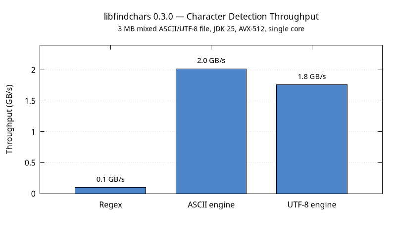

[](https://github.com/debe/libfindchars/actions/workflows/build.yml)
[](https://www.apache.org/licenses/LICENSE-2.0)
[](https://jdk.java.net/25/)

libfindchars
====

libfindchars is a character detection library that can find ASCII and multi-byte UTF-8 characters in byte sequences really fast using SIMD instructions on the JVM.
Use cases are tokenizers, parsers or various pre-processing steps involving fast character detection.
As it heavily utilizes the SIMD instruction set it's more useful when the input is not smaller than the typical vector size e.g. 32 bytes.

See the [Benchmark](#benchmark) how fast it is. It typically reaches around **2 GB/s** throughput for ASCII
and **1.8 GB/s** for UTF-8 on a single core.

Here are some tricks it uses:
 * Vector shuffle mask operation which acts as a lookup table hack.
   To do this the compiler builds and solves an equation system containing hundreds of bitwise operations
   in equations and inequations to actually find a working vector configuration (only two vectors needed most of the time).
   This is done by using the theorem prover [z3](https://github.com/Z3Prover/z3) as normal SAT solving systems
   are simply not clever enough to find a solution.
 * UTF-8 multi-byte character detection via per-round shuffle mask solving across continuation bytes.
 * Bytecode-compiled engine with `BytecodeInliner` for zero-overhead inlined SIMD — the engine operations are compiled into a single class, eliminating virtual dispatch entirely.
 * Vector range operation to find character ranges quickly.
 * Bit hacks to calculate the positions quickly.
 * Auto growing native arrays and memory segments.
 * Sealed-interface runtime engine with bimorphic dispatch for optimal C2 JIT inlining.


A typical usage looks like this.

You start by configuring and building your `FindCharsEngine`:

```java
var config = EngineConfiguration.builder()
        .shuffleOperation(
                new ShuffleOperation(
                        new AsciiLiteralGroup(
                                "structurals",
                                new AsciiLiteral("whitespaces", "\r\n\t\f ".toCharArray()),
                                new AsciiLiteral("punctiations", ":;{}[]".toCharArray()),
                                new AsciiLiteral("star", "*".toCharArray()),
                                new AsciiLiteral("plus", "+".toCharArray())
                        ),
                        new AsciiLiteralGroup(
                                "numbers",
                                new AsciiLiteral("nums", "0123456789".toCharArray())
                        )
                ))
        .rangeOperations(new RangeOperation("comparison", 0x3c, 0x3e))
        .build();
var result = EngineBuilder.build(config);
var findCharsEngine = result.engine();
var literals = result.literals();
```

Then use the engine to find characters in memory-mapped files:

```java
byte STAR = literals.get("star");
byte WHITESPACES = literals.get("whitespaces");
byte PUNCTIATIONS = literals.get("punctiations");
byte PLUS = literals.get("plus");
byte NUMS = literals.get("nums");
byte COMPARISON = literals.get("comparison");

var fileURI = FindLiteralsAndPositions.class.getClassLoader().getResource("dummy.txt").toURI();

try (Arena arena = Arena.ofConfined();
     var channel = FileChannel.open(Path.of(fileURI), StandardOpenOption.READ)) {
    var mappedFile = channel.map(MapMode.READ_ONLY, 0, channel.size(), arena);
    var matchStorage = new MatchStorage((int) channel.size() / 4, 32);
    var match = findCharsEngine.find(mappedFile, matchStorage);

    for (int i = 0; i < match.size(); i++) {
        byte lit = match.getLiteralAt(matchStorage, i);
        int pos = match.getPositionAt(matchStorage, i);

        if (lit == STAR) {
            System.out.println("* at: " + pos);
        } else if (lit == WHITESPACES) {
            System.out.println("\\w at: " + pos);
        } else if (lit == PUNCTIATIONS) {
            System.out.println("punctuations at: " + pos);
        } else if (lit == PLUS) {
            System.out.println("+ at: " + pos);
        } else if (lit == NUMS) {
            System.out.println("numbers at: " + pos);
        } else if (lit == COMPARISON) {
            System.out.println("<>= at: " + pos);
        }
    }
}
```

Benchmark
---------

JMH benchmark on a 3 MB mixed ASCII/UTF-8 file, detecting 26 distinct characters
(21 ASCII + 5 multi-byte UTF-8) across 2 shuffle groups and 1 range operation.
Environment: JDK 25, AVX-512, single core.



| Engine             | Ops/s | Throughput |
|--------------------|------:|------------|
| ASCII compiled     |   672 | ~2.0 GB/s  |
| UTF-8 compiled     |   586 | ~1.8 GB/s  |
| Regex baseline     |    33 | ~0.1 GB/s  |

The compiled engines use bytecode-generated SIMD kernels via `BytecodeInliner`,
eliminating all virtual dispatch overhead. Both ASCII and UTF-8 engines outperform
compiled regex by roughly **20x**.
