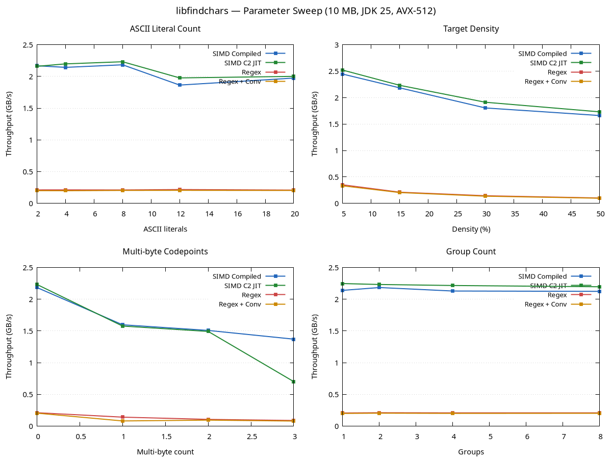
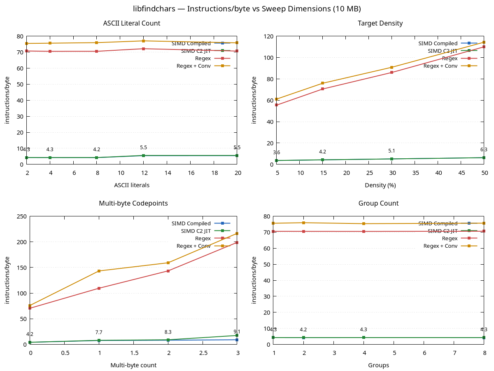
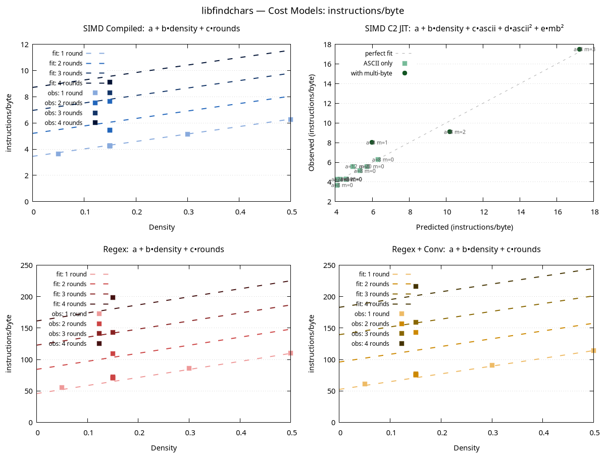
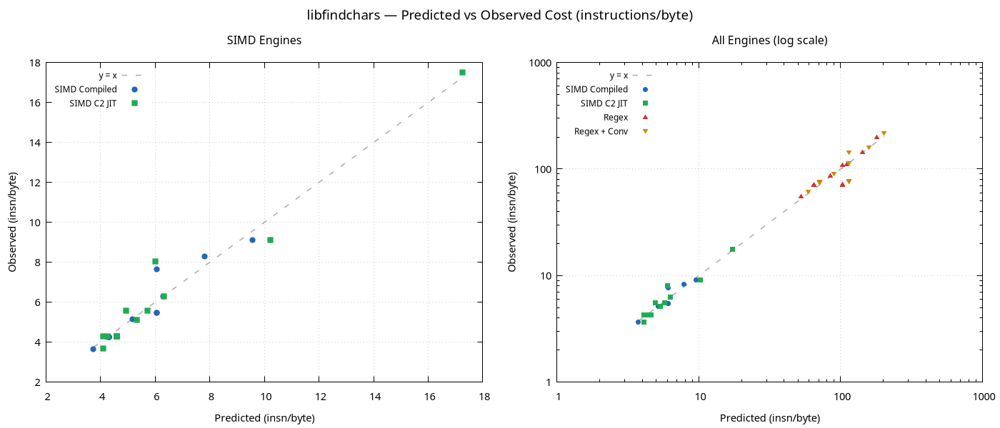

[](https://github.com/debe/libfindchars/actions/workflows/build.yml)
[](https://www.apache.org/licenses/LICENSE-2.0)
[](https://jdk.java.net/25/)

libfindchars
====

libfindchars is a character detection library that can find ASCII and multi-byte UTF-8 characters in byte sequences really fast using SIMD instructions on the JVM.
Use cases are tokenizers, parsers or various pre-processing steps involving fast character detection.
As it heavily utilizes the SIMD instruction set it's more useful when the input is not smaller than the typical vector size e.g. 32 bytes.

See the [Benchmark](#benchmark) how fast it is. It typically reaches around **2 GB/s** throughput for pure ASCII
and **1.5 GB/s** for mixed ASCII/UTF-8 on a single core.

Here are some tricks it uses:
 * **Z3 nibble-matrix solver.** Each byte is split into its low and high nibble (4 bits each), giving a 16×16 lookup grid.
   The compiler feeds hundreds of bitwise constraints into the [Z3 theorem prover](https://github.com/Z3Prover/z3) to find two 16-entry shuffle vectors whose AND produces a unique literal byte for every target character and zero for everything else.
   A single shuffle group reliably solves ~12 ASCII literals; auto-split doubles that to ~20–24 by solving two independent halves.
   All literal IDs share the range [1, 63], capping total distinct literals at 63 per engine (see [Solver limits](#solver-limits)).
 * **UTF-8 multi-byte detection** via per-round shuffle mask solving across continuation bytes.
 * **Vector range operations** for matching contiguous byte ranges (e.g. `<=>`, `0-9`) without consuming nibble-matrix capacity — each range costs only 1 literal ID.
 * **Bytecode-compiled engine** with `BytecodeInliner` for zero-overhead inlined SIMD — the engine operations are compiled into a single class, eliminating virtual dispatch entirely.
 * Bit hacks to calculate the positions quickly.
 * Auto growing native arrays and memory segments.

## Installation

Requires **JDK 25**. Bytecode is compiled with `--enable-preview` and depends on `jdk.incubator.vector`.

### Maven

```xml
<dependency>
    <groupId>org.knownhosts</groupId>
    <artifactId>libfindchars-compiler</artifactId>
    <version>0.4.0-jdk25-preview</version>
</dependency>
```

### Gradle

```kotlin
implementation("org.knownhosts:libfindchars-compiler:0.4.0-jdk25-preview")
```

### Runtime JVM arguments

Your application must be launched with:

```
--enable-preview --add-modules=jdk.incubator.vector
```

## Usage

### ASCII characters with range operations

```java
var result = Utf8EngineBuilder.builder()
        .codepoints("whitespaces", '\r', '\n', '\t', '\f', ' ')
        .codepoints("punctuation", ':', ';', '{', '}', '[', ']')
        .codepoints("star", '*')
        .codepoints("plus", '+')
        .codepoints("nums", '0', '1', '2', '3', '4', '5', '6', '7', '8', '9')
        .range("comparison", (byte) 0x3c, (byte) 0x3e)
        .build();
var findCharsEngine = result.engine();
var literals = result.literals();
```

### Multi-byte UTF-8 characters

```java
var result = Utf8EngineBuilder.builder()
        .codepoints("whitespace", ' ', '\n')
        .codepoint("eacute", 0xE9)       // é  2-byte
        .codepoint("trademark", 0x2122)   // ™  3-byte
        .codepoint("grin", 0x1F600)       // 😀 4-byte
        .build();
var engine = result.engine();
var literals = result.literals();
```

### Using the engine

```java
byte STAR = literals.get("star");
byte WHITESPACES = literals.get("whitespaces");
byte COMPARISON = literals.get("comparison");

try (Arena arena = Arena.ofConfined();
     var channel = FileChannel.open(Path.of(fileURI), StandardOpenOption.READ)) {
    var mappedFile = channel.map(MapMode.READ_ONLY, 0, channel.size(), arena);
    var matchStorage = new MatchStorage((int) channel.size() / 4, 32);
    var match = findCharsEngine.find(mappedFile, matchStorage);

    for (int i = 0; i < match.size(); i++) {
        byte lit = match.getLiteralAt(matchStorage, i);
        int pos = match.getPositionAt(matchStorage, i);

        if (lit == STAR) {
            System.out.println("* at: " + pos);
        } else if (lit == WHITESPACES) {
            System.out.println("\\w at: " + pos);
        } else if (lit == COMPARISON) {
            System.out.println("<>= at: " + pos);
        }
    }
}
```

## Solver limits

The Z3-based compiler has two constraints that limit how many characters can be classified:

**Nibble matrix (per shuffle group):** Each group of ASCII literals is solved via a 16×16 lookup table indexed by the low and high nibble of each byte. Characters sharing a nibble row compete for the same table entries. In practice, a single shuffle group reliably solves **up to ~12 ASCII literals**. If Z3 finds no solution, the compiler auto-splits the group in half and solves each independently, extending the practical limit to **~20–24 ASCII literals per round**.

**Literal namespace (whole engine):** Every literal — ASCII groups, multi-byte codepoints, and range operations — gets a unique byte ID in the range `[1, vectorByteSize-1]`. With 64-byte vectors (AVX-512 / `SPECIES_512`) this means **at most 63 distinct literals** across the entire engine. Multi-byte codepoints reuse IDs across rounds (one per UTF-8 byte), so they cost 1 literal each, same as an ASCII group.

**Range operations** are cheap: each range counts as 1 literal and is evaluated separately from the nibble matrix, so ranges don't affect Z3 solvability.

In summary, a typical engine configuration can classify **20+ ASCII character groups**, **several multi-byte codepoints**, and **multiple byte ranges** without hitting limits.

## Building

Requires JDK 25 with `--enable-preview` and `--add-modules=jdk.incubator.vector`.

> **Note**: Published artifacts use the version format `{semver}-jdk25-preview` (e.g. `0.4.0-jdk25-preview`) to signal that bytecode is compiled with `--enable-preview` and locked to JDK 25. Consumers must run JDK 25 and pass `--add-modules=jdk.incubator.vector` at runtime.

```bash
mvn clean install
```

## Benchmark

Environment: JDK 25, AVX-512, single core, 10 MB data. Parameter sweep varies ASCII literal count, density, multi-byte codepoint count, and group count independently. SIMD is **7–16x faster** than regex depending on density.



### Cost model

Hardware counters (`-prof perfnorm`) show cost is driven by match density and shuffle rounds. ASCII count and group count have minimal effect.



SIMD Compiled, Regex, and Regex + Conv fit a linear model: `insn/byte = a + b·density + c·rounds`, where `rounds = (ascii > 10 ? 2 : 1) + mb_count`.

| Engine | a | b (density) | c (rounds) | R² |
|--------|---:|---:|---:|---:|
| SIMD Compiled | 1.70 | 5.68 | 1.75 | 0.90 |
| Regex  | 7.42 | 127.84 | 38.46 | 0.87 |
| Regex + Conv | 9.06 | 123.29 | 43.49 | 0.84 |

The compiled engine's density cost is **22x smaller** than regex (5.7 vs 128 insn/byte) and its per-round cost is **22x smaller** (1.8 vs 38 insn/byte).

The C2 JIT engine fits a quadratic model instead: `insn/byte = a + b·density + c·ascii + d·ascii² + e·mb²` (R²=0.96). Multi-byte scaling dominates (e=1.41); ascii scaling is negligible (d=0.001). The compiled engine is 2x faster than C2 JIT at 3 multi-byte codepoints because `BytecodeInliner` eliminates virtual dispatch.




```bash
# Full sweep (~6 min)
scripts/run-sweep.sh

# With hardware counters
scripts/run-sweep.sh --perfnorm

# Quick smoke test (~1 min)
scripts/run-sweep.sh --quick

# Regenerate plots / cost model from existing data
gnuplot libfindchars-bench/sweep-overview.gnuplot
gnuplot libfindchars-bench/sweep-instructions.gnuplot
gnuplot libfindchars-bench/sweep-cost-model.gnuplot
gnuplot libfindchars-bench/sweep-cost-model-combined.gnuplot
python3 scripts/fit-cost-model.py docs/sweep-data/
```
