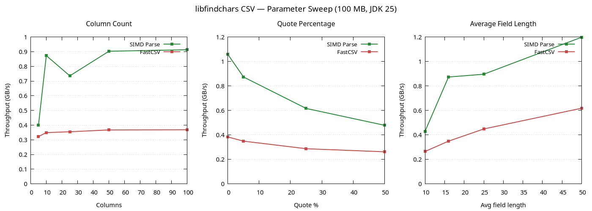

[](https://github.com/debe/libfindchars/actions/workflows/build.yml)
[](https://www.apache.org/licenses/LICENSE-2.0)
[](https://jdk.java.net/25/)

libfindchars
====

libfindchars is a character detection library that can find ASCII and multi-byte UTF-8 characters in byte sequences really fast using SIMD instructions on the JVM.
Use cases are tokenizers, parsers or various pre-processing steps involving fast character detection.
As it heavily utilizes the SIMD instruction set it's more useful when the input is not smaller than the typical vector size e.g. 32 bytes.

See the [Benchmark](#benchmark) how fast it is. It typically reaches around **2 GB/s** throughput for pure ASCII
and **1.5 GB/s** for mixed ASCII/UTF-8 on a single core.

Here are some tricks it uses:
 * **Z3 nibble-matrix solver.** Each byte is split into its low and high nibble (4 bits each), giving a 16×16 lookup grid.
   The compiler feeds hundreds of bitwise constraints into the [Z3 theorem prover](https://github.com/Z3Prover/z3) to find two 16-entry shuffle vectors whose AND produces a unique literal byte for every target character and zero for everything else.
   A single shuffle group reliably solves ~12 ASCII literals; auto-split doubles that to ~20–24 by solving two independent halves.
   All literal IDs share the range [1, 63], capping total distinct literals at 63 per engine (see [Solver limits](#solver-limits)).
 * **UTF-8 multi-byte detection** via per-round shuffle mask solving across continuation bytes.
 * **Vector range operations** for matching contiguous byte ranges (e.g. `<=>`, `0-9`) without consuming nibble-matrix capacity — each range costs only 1 literal ID.
 * **Bytecode-compiled engine** with `BytecodeInliner` for zero-overhead inlined SIMD — the engine operations are compiled into a single class, eliminating virtual dispatch entirely.
 * **VPA chunk filters** for parsing beyond regular languages. Vectorized parallel prefix operations (`prefixXor` for quote toggle, `prefixSum` for nesting depth) enable SIMD-accelerated parsing of CSV, JSON, TOML and other visibly pushdown languages — see [VPA Chunk Filter Framework](#vpa-chunk-filter-framework).
 * Bit hacks to calculate the positions quickly.
 * Auto growing native arrays and memory segments.

## Installation

Requires **JDK 25**. Bytecode is compiled with `--enable-preview` and depends on `jdk.incubator.vector`.

### Maven

```xml
<dependency>
    <groupId>org.knownhosts</groupId>
    <artifactId>libfindchars-compiler</artifactId>
    <version>0.4.0-jdk25-preview</version>
</dependency>
```

### Gradle

```kotlin
implementation("org.knownhosts:libfindchars-compiler:0.4.0-jdk25-preview")
```

### Runtime JVM arguments

Your application must be launched with:

```
--enable-preview --add-modules=jdk.incubator.vector
```

## Usage

### ASCII characters with range operations

```java
var result = Utf8EngineBuilder.builder()
        .codepoints("whitespaces", '\r', '\n', '\t', '\f', ' ')
        .codepoints("punctuation", ':', ';', '{', '}', '[', ']')
        .codepoints("star", '*')
        .codepoints("plus", '+')
        .codepoints("nums", '0', '1', '2', '3', '4', '5', '6', '7', '8', '9')
        .range("comparison", (byte) 0x3c, (byte) 0x3e)
        .build();
var findCharsEngine = result.engine();
var literals = result.literals();
```

### Multi-byte UTF-8 characters

```java
var result = Utf8EngineBuilder.builder()
        .codepoints("whitespace", ' ', '\n')
        .codepoint("eacute", 0xE9)       // é  2-byte
        .codepoint("trademark", 0x2122)   // ™  3-byte
        .codepoint("grin", 0x1F600)       // 😀 4-byte
        .build();
var engine = result.engine();
var literals = result.literals();
```

### Using the engine

```java
byte STAR = literals.get("star");
byte WHITESPACES = literals.get("whitespaces");
byte COMPARISON = literals.get("comparison");

try (Arena arena = Arena.ofConfined();
     var channel = FileChannel.open(Path.of(fileURI), StandardOpenOption.READ)) {
    var mappedFile = channel.map(MapMode.READ_ONLY, 0, channel.size(), arena);
    var matchStorage = new MatchStorage((int) channel.size() / 4, 32);
    var match = findCharsEngine.find(mappedFile, matchStorage);

    for (int i = 0; i < match.size(); i++) {
        byte lit = match.getLiteralAt(matchStorage, i);
        long pos = match.getPositionAt(matchStorage, i);

        if (lit == STAR) {
            System.out.println("* at: " + pos);
        } else if (lit == WHITESPACES) {
            System.out.println("\\w at: " + pos);
        } else if (lit == COMPARISON) {
            System.out.println("<>= at: " + pos);
        }
    }
}
```

## VPA Chunk Filter Framework

The base engine recognizes regular languages — it classifies bytes independently with no memory between positions. Real-world formats need more: CSV requires knowing whether a comma is inside quotes, JSON requires tracking brace/bracket depth.

In the [Chomsky hierarchy](https://en.wikipedia.org/wiki/Chomsky_hierarchy), these formats sit between regular and context-free:

```
Regular (Type 3)          — finite automaton, no stack
    ↑ libfindchars base engine: character detection, range ops
Visibly Pushdown (VPL)    — stack ops determined by input symbol
    ↑ VPA chunk filters: prefixXor (toggle), prefixSum (depth)
Context-Free (Type 2)     — full PDA, stack ops depend on state
```

A [Visibly Pushdown Automaton](https://en.wikipedia.org/wiki/Visibly_pushdown_automaton) (VPA) partitions the input alphabet into *call* (push), *return* (pop), and *internal* symbols. Because the stack action is determined by the input symbol alone — not the automaton's state — the stack evolution can be computed in parallel across a vector of input bytes. This is what makes VPA the sweet spot for SIMD parsing: you get structural awareness beyond regex while keeping the computation vectorizable.

### Primitives

`VpaKernel` provides two parallel prefix operations, both using the Hillis-Steele pattern in O(log₂ V) vector steps:

| Primitive | Stack model | Operation | Use cases |
|-----------|------------|-----------|-----------|
| `prefixXor` | Stack-1 (binary toggle) | `result[i] = v[0] ^ v[1] ^ ... ^ v[i]` | CSV/TSV quotes, JSON/TOML string literals, SQL quoted identifiers |
| `prefixSum` | Stack-n (bounded depth) | `result[i] = v[0] + v[1] + ... + v[i]` | JSON `{}[]` nesting, TOML `[[]]` array-of-tables, XML element depth |

A chunk filter composes these primitives to transform the SIMD accumulator *between* detection and position decode. Lanes that fall inside quoted regions or at the wrong nesting depth are zeroed out — the downstream match walker sees only structurally relevant tokens.

### How formats map to VPA

**CSV** — Stack-1 only. Detect `,` `"` `\n` `\r`. Apply `prefixXor` on quote positions to toggle inside/outside state. Zero out commas and newlines inside quoted regions. One cross-chunk carry byte (`state[0]`).

**JSON** — Stack-1 + Stack-n. Detect `{` `}` `[` `]` `"` `,` `:`. Apply `prefixXor` on `"` to mask structural characters inside strings. Then `prefixSum` on `{[` (+1) and `}]` (-1) to compute nesting depth per position. Structural tokens carry their depth — the match walker can extract nested objects without a state machine.

**TOML** — Stack-1 + Stack-n. Detect `[` `]` `"` `=` `\n` `#`. Apply `prefixXor` on `"` to mask inside strings. `prefixSum` on brackets for table/array-of-tables nesting. Comment lines (`#` to `\n`) can be handled as a second `prefixXor` pass.

### Builder API

```java
var result = Utf8EngineBuilder.builder()
        .codepoints("quote", '"')
        .codepoints("delim", ',')
        .codepoints("lf", '\n')
        .chunkFilter(MyFilter.class, "quote", "delim", "lf")
        .build();
```

The filter class must provide an `@Inline public static ByteVector apply(...)` method matching the `ChunkFilter` signature. The engine provides:
- **`state`** — mutable `long[8]`, reset per `find()` call, for cross-chunk carry (quote toggles, depth counters)
- **`scratchpad`** — mutable `byte[vectorByteSize]`, engine-owned working memory
- **`literals`** — immutable `ByteVector[]` of pre-broadcast literal vectors, indexed by binding order

The filter is bytecode-inlined into the engine at build time — zero virtual dispatch overhead at runtime.

## CSV Parser

`libfindchars-csv` is the first application of the VPA framework — a SIMD-accelerated CSV parser using only the Stack-1 (`prefixXor`) primitive. Full zero-copy parse reaches **~0.9–1.3 GB/s** on a single core depending on field density, **2–3x faster** than [FastCSV](https://github.com/osiegmar/FastCSV).

> **Note**: `libfindchars-csv` is not yet published to Maven Central. Build from source with `mvn install -pl libfindchars-csv -am`.

```java
var parser = CsvParser.builder()
        .delimiter(',')
        .quote('"')
        .hasHeader(true)
        .build();

try (var arena = Arena.ofConfined()) {
    var result = parser.parse(Path.of("data.csv"), arena);
    for (int i = 0; i < result.rowCount(); i++) {
        System.out.println(result.row(i).get(0)); // zero-copy until String materialization
    }
}
```

Custom delimiters and quote characters:

```java
// Tab-delimited with single-quote quoting
var tsvParser = CsvParser.builder()
        .delimiter('\t')
        .quote('\'')
        .build();

// Pipe-delimited
var pipeParser = CsvParser.builder()
        .delimiter('|')
        .build();
```

Architecture: the engine detects `,` `"` `\n` `\r` via SIMD, the `CsvQuoteFilter` applies `prefixXor` to zero out structural characters inside quoted regions, and a linear match walker maps commas to field boundaries and newlines to row boundaries. No state machine needed.

## Solver limits

The Z3-based compiler has two constraints that limit how many characters can be classified:

**Nibble matrix (per shuffle group):** Each group of ASCII literals is solved via a 16×16 lookup table indexed by the low and high nibble of each byte. Characters sharing a nibble row compete for the same table entries. In practice, a single shuffle group reliably solves **up to ~12 ASCII literals**. If Z3 finds no solution, the compiler recursively auto-splits the group in half until each subgroup is solvable. On AVX-512 (64-byte vectors) this typically means 1–2 groups; on ARM NEON (16-byte vectors) the tighter literal namespace may require 3–6 groups per round.

**Literal namespace (whole engine):** Every literal — ASCII groups, multi-byte codepoints, and range operations — gets a unique byte ID in the range `[1, vectorByteSize-1]`. With 64-byte vectors (AVX-512 / `SPECIES_512`) this means **at most 63 distinct literals**; with 16-byte vectors (ARM NEON / `SPECIES_128`) the limit is **15 distinct literals**. Multi-byte codepoints reuse IDs across rounds (one per UTF-8 byte), so they cost 1 literal each, same as an ASCII group.

**Range operations** are cheap: each range counts as 1 literal and is evaluated separately from the nibble matrix, so ranges don't affect Z3 solvability.

In summary, a typical engine configuration can classify **20+ ASCII character groups**, **several multi-byte codepoints**, and **multiple byte ranges** without hitting limits.

## Building

Requires JDK 25 with `--enable-preview` and `--add-modules=jdk.incubator.vector`.

> **Note**: Published artifacts use the version format `{semver}-jdk25-preview` (e.g. `0.4.0-jdk25-preview`) to signal that bytecode is compiled with `--enable-preview` and locked to JDK 25. Consumers must run JDK 25 and pass `--add-modules=jdk.incubator.vector` at runtime.

```bash
mvn clean install
```

## Benchmark

Environment: JDK 25, AVX-512, single core, 10 MB data. Parameter sweep varies ASCII literal count, density, multi-byte codepoint count, and group count independently. SIMD is **7–16x faster** than regex depending on density.


### Cost model

Hardware counters (`-prof perfnorm`) show cost is driven by match density and shuffle rounds. ASCII count and group count have minimal effect.


SIMD Compiled, Regex, and Regex + Conv fit a linear model: `insn/byte = a + b·density + c·rounds`, where `rounds = (ascii > 10 ? 2 : 1) + mb_count`.

| Engine | a | b (density) | c (rounds) | R² |
|--------|---:|---:|---:|---:|
| SIMD Compiled | 1.70 | 5.68 | 1.75 | 0.90 |
| Regex  | 7.42 | 127.84 | 38.46 | 0.87 |
| Regex + Conv | 9.06 | 123.29 | 43.49 | 0.84 |

The compiled engine's density cost is **22x smaller** than regex (5.7 vs 128 insn/byte) and its per-round cost is **22x smaller** (1.8 vs 38 insn/byte).

The C2 JIT engine fits a quadratic model instead: `insn/byte = a + b·density + c·ascii + d·ascii² + e·mb²` (R²=0.96). Multi-byte scaling dominates (e=1.41); ascii scaling is negligible (d=0.001). The compiled engine is 2x faster than C2 JIT at 3 multi-byte codepoints because `BytecodeInliner` eliminates virtual dispatch.


```bash
# Full sweep (~6 min)
scripts/run-sweep.sh

# With hardware counters
scripts/run-sweep.sh --perfnorm

# Quick smoke test (~1 min)
scripts/run-sweep.sh --quick

# Regenerate plots / cost model from existing data
gnuplot libfindchars-bench/sweep-overview.gnuplot
gnuplot libfindchars-bench/sweep-instructions.gnuplot
gnuplot libfindchars-bench/sweep-cost-model.gnuplot
gnuplot libfindchars-bench/sweep-cost-model-combined.gnuplot
python3 scripts/fit-cost-model.py docs/sweep-data/
```

### CSV parser benchmark

Environment: JDK 25, AVX-512, single core, 100 MB data. Parameter sweep varies column count, quote percentage, and average field length independently. Baseline: 10 columns, 5% quotes, avg field length 16. The benchmark iterates every row and field via zero-copy `rawField()` access (no String materialization). Compared against [FastCSV](https://github.com/osiegmar/FastCSV) which materializes all field Strings.



SIMD Parse reaches **~0.86 GB/s** at baseline, **2.5x faster** than FastCSV (~0.35 GB/s). At longer fields (25–50 bytes) throughput climbs to **1.0–1.3 GB/s**. Key observations:

- **Column count** has minimal effect on parse speed — the SIMD engine processes structural characters at a constant rate regardless of field count.
- **Quote percentage** reduces throughput as the `CsvQuoteFilter` prefix XOR overhead increases with more quoted regions.
- **Field length** has the largest impact — shorter fields mean higher structural character density per byte, increasing per-match work in the scalar match walker.

```bash
# Full CSV sweep
scripts/run-csv-sweep.sh

# With hardware counters
scripts/run-csv-sweep.sh --perfnorm

# Quick smoke test
scripts/run-csv-sweep.sh --quick

# Regenerate plots from existing data
gnuplot libfindchars-bench/csv-sweep-overview.gnuplot
```
