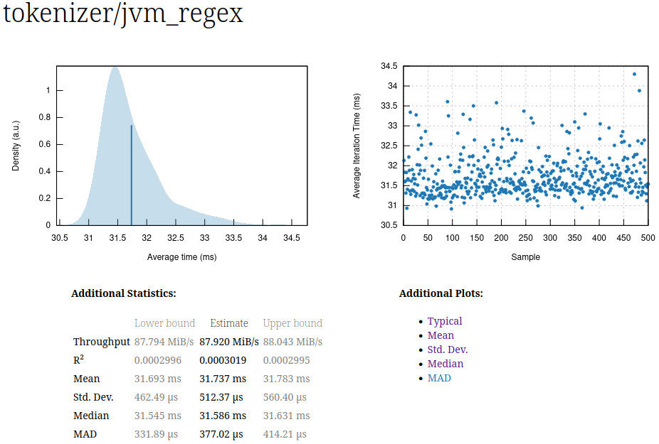
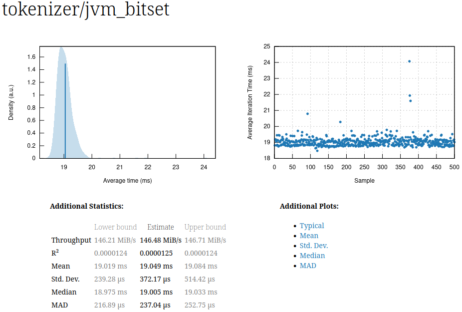
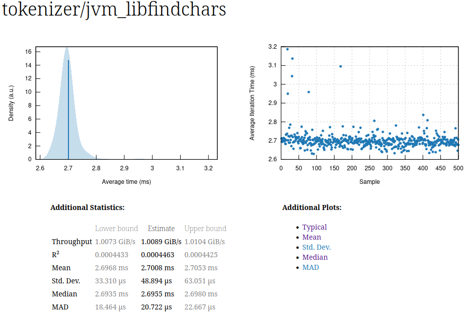

libfindchars
====

libfindchars is a character detection library that can find any ASCII character in byte sequences really fast using SIMD instructions on the JVM.
Use cases are tokenizers, parsers or various pre-processing steps involving fast character detection.
As it heavily utilizes the SIMD instruction set it's more useful when the input is not smaller than the typical vector size e.g. 32 bytes.

See the [Benchmark](#benchmark) how fast it is. It typically reaches around **1 GiB/s** throughput 
on a single core for a text file containing 20% tokens.

Here are some tricks it uses:
 * vector shuffle mask operation which acts as lookup table hack. 
   To do this the compiler builds and solves an equation system containing hundreds of bitwise operations 
   in equations and inequations to actually find a working vector configuration (only two vectors needed most of the time).
   This is done by using the theorem prover [z3](https://github.com/Z3Prover/z3) as normal SAT solving systems 
   are simply not clever enough to find a solution.
 * vector range operation to find character ranges quickly.
 * Bit hacks to calculate the positions quickly.
 * Auto growing native arrays and memory segments.
 * Code generation utilizes loop unrolling and constant definition to provide a fast interface for the findings using modern switch expressions. 


A typical usage looks like this.

You start by generating your FindCharsEngine like this.

```java
EngineConfiguration config = new EngineConfiguration()
  .withTarget(new Target()
      .withDirectory("src/main/java")
      .withPackageName("zz.customname")
      )
  .withRangeOperations(new RangeOperation("comparison").withRange(0x3c, 0x3e))
  .withShuffleOperation(
      new ShuffleOperation()
        .withLiteralGroups(
            new AsciiLiteralGroup(
                "structurals", 
                new AsciiLiteral("whitespaces","\r\n\t\f ".toCharArray()),
                new AsciiLiteral("punctiations",":;{}[]".toCharArray()),
                new AsciiLiteral("star","*".toCharArray()),
                new AsciiLiteral("plus","+".toCharArray())
            ),
            new AsciiLiteralGroup(
                "numbers", 
                new AsciiLiteral("nums","0123456789".toCharArray())
            )
          ));
EngineBuilder.build(config);
```

This will compile you two files one custom Engine `FindCharsEngine.java` and `FindCharsLiterals.java`.
After that find something with.

```java
public static void main(String[] args) throws Exception {
  
  var findCharsEngine = new FindCharsEngine();
  var fileURI = FindLiteralsAndPositions.class.getClassLoader().getResource("dummy.txt").toURI();
  
  try(Arena arena = Arena.openConfined();
    var channel = FileChannel.open(Path.of(fileURI), StandardOpenOption.READ)){      
    var mappedFile = channel.map(MapMode.READ_ONLY, 0, channel.size(), arena.scope());
    var matchStorage = new MatchStorage((int)channel.size() / 7 << 1, 32);

    var match = findCharsEngine.find(mappedFile, matchStorage);

    for(int i = 0; i < match.size();i++) {

      switch(match.getLiteralAt(matchStorage, i)) {
        case FindCharsLiterals.STAR -> System.out.println("* at: "+ match.getPositionAt(matchStorage, i));
        case FindCharsLiterals.WHITESPACES -> System.out.println("\\w at: "+ match.getPositionAt(matchStorage, i));
        case FindCharsLiterals.PUNCTIATIONS -> System.out.println("punctuations at: "+ match.getPositionAt(matchStorage, i));
        case FindCharsLiterals.PLUS -> System.out.println("+ at: "+ match.getPositionAt(matchStorage, i));
        case FindCharsLiterals.NUMS -> System.out.println("numbers at: "+ match.getPositionAt(matchStorage, i));
        case FindCharsLiterals.COMPARISON -> System.out.println("<>= at: "+ match.getPositionAt(matchStorage, i));
      }
    }
  }
}
```

Benchmark
---------

The following benchmark was done by parsing a 3 MB clear text file and finding 13 different tokens 
with a token density is approx 20% in this file. Three tests where conducted using a combination of
the actual finding algorithm implemented in java and the measurement and evaluation code using 
the great [criterion.rs](https://github.com/bheisler/criterion.rs) benchmarking kit for rust.

Libfindchars beat them all by an order of magnitude to reach an average of **1 GiB/s** throughput
using a single core.

1. A compiled regex Pattern to find tokens and have the knowledge which token it was.
   
2. A bitset to find tokens without the knowledge which token matched. Only useful for token groups e.g. all whitespaces.
   
3. libfindchars using a generated engine.
   

   